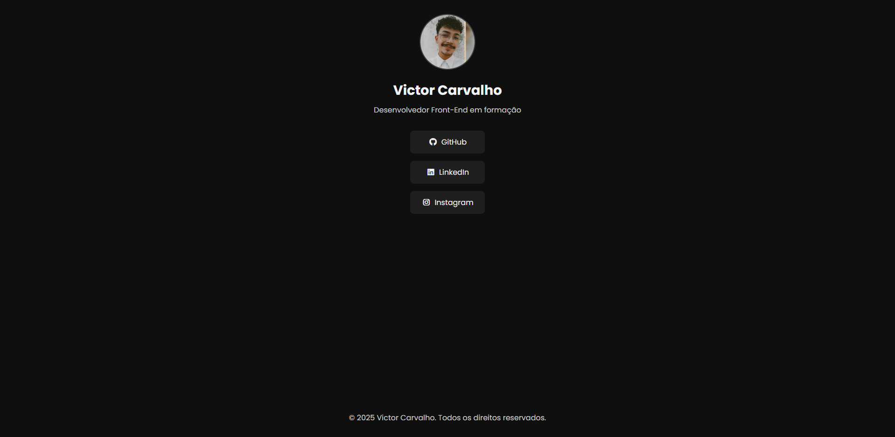

# DevLinks - Victor Carvalho

Projeto pessoal de página de links sociais desenvolvido com **HTML e CSS**, inspirado em perfis de redes sociais como Linktree.

## 🔗 Acesse o Projeto Online

👉 [Clique aqui para ver o projeto publicado](https://victorcarvalhob.github.io/devlinks-victor/)

## 📸 Preview

## 💡 Funcionalidades

- Layout responsivo
- Design moderno e acessível
- Ícones integrados via Font Awesome
- Estilização com variáveis CSS
- Organização semântica do HTML

## 🛠 Tecnologias Utilizadas

- HTML5
- CSS3
- Font Awesome
- Google Fonts (Poppins, Roboto)

## 🧑‍💻 Autor

Feito com 💻 por **Victor Carvalho**  
[GitHub](https://github.com/victorcarvalhob) | [LinkedIn](https://www.linkedin.com/in/victor-carvalho-39b340358/)
